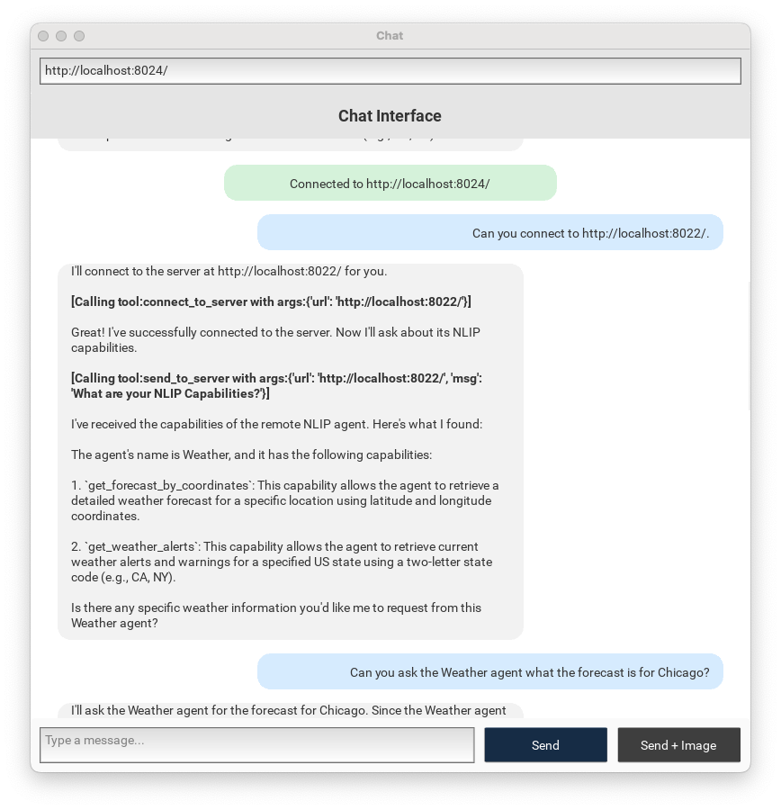

# NLIP Agents

This project provides a light framework for building Agents that speak NLIP protocol and for building Agent-to-Agent networks on top of NLIP.

Features:

- LiteLLM -  makes it simple to connect a wide variety of LLMs, both local and remote.
- Tools - integration via Python functions.
- Prompts - instruction inclusion.
- Conversation History
- Agent-to-Agent

The screenshot below illustrates an Agent-to-Agent session using NLIP with the [Mach2 Chat App](https://github.com/sheffler/kivy-client-mach2).  There is a Coordinator Agent at `http://localhost:2024` and a second agent at `http://localhost:2022` that has a tool for obtaining weather forecasts.  We have asked the Coordinator Agent to connect to the remote agent.  After it is connected, we have asked the coordinator Agent to ask the Weather Agent for a forecast for Chicago.




## How to use this package

We recommend checking out the NLIP SDK dependency in a directory adjacent to this project's directory.

    $ mkdir git
	$ cd git
	$ git clone https://github.com/nlip-project/nlip_sdk
	$ git clone https://github.com/sheffler/nlip_agents
	

This project works well with `uv`.

1. Create a virtual environment.

        $ cd git/nlip_agents
        $ uv venv
    	$ . .venv/bin/activate
		
2. Synchronize the project dependencies

        $ uv sync
		
3. Run a program

        $ python run_basic.py &
		


## How to run

Use the top-level scripts to run the various web servers.

    $ cd git/nlip_agents
    $ python run_basic.py &
    $ python run_weather.py &
    $ python run_coordinator.py &
   
The individual agents have built-in console runners for interacting with them directly in the terminal.  Use python with the `-m` flag to set up the package properly.

    $ cd git/nlip_agents
    $ python -m nlip_agents.agents.weather_agent
    
## Put secrets in the .env file

This project uses LiteLLM to connect to various LLMs.  If using a paid or remote LLM that requires a key, you can place it in the `.env` file in the root of the project.

For example, if you are using Anthropic, you would place your API KEY in it.

    ANTHROPIC_API_KEY=sk-ant-api03-b2R1absad...


## Running the Multi-Agent Agent-to-Agent Demonstration

Enter `http://localhost:8024` in the URL location bar at the top to connect to the Coordinator Agent.

Now enter this prompt to ask the Coordinator agent about it's capabilities.

    Hello.  Please describe your NLIP Capabilities.
    
Now ask the Coordinator agent to talk to the Weather agent.

    Please connect to http://localhost:8022.
    
You will notice the Coordinator contacting the other agent, asking for its NAME and CAPABILITIES.

Now ask the Coordinator to talk to the Weather agent.

    Can you ask the Weather Agent what the forecast for Chicago is?


## Defining a new agent

An agent employs an LLM to respond to natural language inputs and generate responses.  The prompt instructs the agent with special knowledge for solving problems, and the tools are functions the LLM can call to obtain information.

``` python
from nlip_agents.agents.basic_agent import BasicAgent

async def mytool(input: str) -> str:
   ... the definition of my tool

PROMPT = "You are an agent with a special purpose."

MODEL = 'ollama_chat/llama3.2:latest'

myAgent = BasicAgent("MyName",
  model=MODEL,
  instruction=PROMPT,
  tools = [ mytool ]
)
					 
```


## To Do

- Natural language negotiation of agent capabilities upon connect.  Discovery of remote agent Name.
- Correleated session handling - spawn a new agent for a new session.
- Flexible logging
