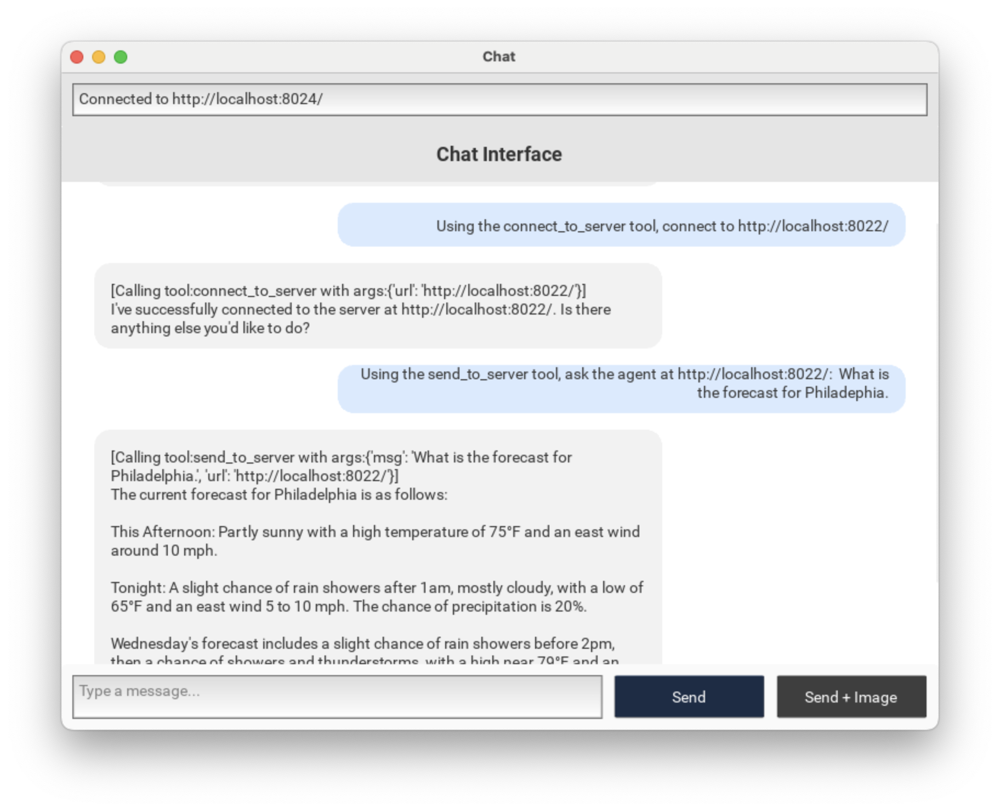

# NLIP Agents

This project provides a simple framework for building Agents that speak NLIP protocol.

Features:

- LiteLLM -  makes it simple to connect a wide variety of LLMs, both local and remote.
- Tools - integration via Python functions.
- Prompts - instruction inclusion.
- Conversation History

The screenshot below illustrates a session between two NLIP agents.  There is a main agent at `http://localhost:2024` and a second agent at `http://localhost:2022` that has a tool for obtaining weather forecasts.  We have instructed the front agent to connect to the back end agent and then for it to ask the Weather agent for a forecast.




## How to use this package

We recommend checking out the NLIP dependencies in directories adjacent to this project's directory.

    $ mkdir git
	$ cd git
	$ git clone https://github.com/nlip-project/nlip_sdk
	$ git clone https://github.com/nlip-project/nlip_server
	$ git clone https://github.com/nlip-project/nlip_client
	$ git clone https://github.com/nlip-project/nlip_agents
	

This project works well with `uv`.

1. Create a virtual environment.

        $ uv venv
    	$ . .venv/bin/activate
		
2. Synchronize the project dependencies

        $ uv sync
		
3. Run a program

        $ python run_basic.py &
		


## How to run

Use the top-level scripts to run the various web servers.

    $ cd git/nlip_agents
    $ python run_basic.py &
    $ python run_weather.py &
    $ python run_nlipagent.py &
   
The individual agents have built-in console runners for interacting with them directly in the terminal.  Use python with the `-m` flag to set up the package properly.

    $ cd git/nlip_agents
    $ python -m nlip_agents.agents.weather_agent


## Defining a new agent

An agent employs an LLM to respond to natural language inputs and generate responses.  The prompt instructs the agent with special knowledge for solving problems, and the tools are functions the LLM can call to obtain information.

``` python
from nlip_agents.agents.basic_agent import BasicAgent

async def mytool(input: str) -> str:
   ... the definition of my tool

PROMPT = "You are an agent with a special purpose."

MODEL = 'ollama_chat/llama3.2:latest'

myAgent = BasicAgent("MyName",
  model=MODEL,
  instruction=PROMPT,
  tools = [ mytool ]
)
					 
```


## To Do

- Natural language negotiation of agent capabilities upon connect.  Discovery of remote agent Name.
- Correleated session handling - spawn a new agent for a new session.
