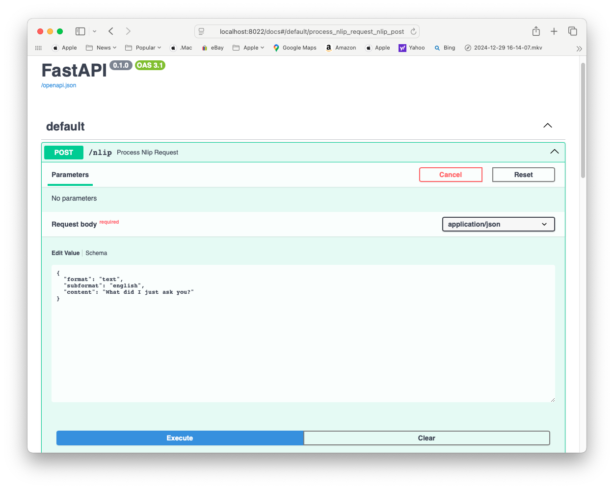

# NLIP Session Server

This is a very simple FastAPI server that can receive and send NLIP Messages.  It implements an Unauthenticated Session store so that multiple conversations can be handled by different instances of an Agent.

## Authentication

This server does not implement any form of authentication.

## Sessions

This server implements a very simple in-memory Session store.  An HTTP Cookie in the client is used to track the Session data.  The Cookie name is configurable.

## The Docs View

FastAPI provides an OpenAPI docs viewer that can be used to interact with the server.  For instance, the Weather Server is normally launched on port 8022, and its docs view can be accessed at the URL shown below.  The NLIP Session Server provides an example minimal NLIP message where you can modify the "content" field and "Execute" a request.  Because there is a session, the conversation history is remembered across requests.

- [http://localhost:8020/docs](http://localhost:8020/docs)  (The Basic Agent)
- [http://localhost:8022/docs](http://localhost:8022/docs)  (The Weather Agent)
- [http://localhost:8024/docs](http://localhost:8024/docs)  (The NLIP Coordinator Agent)

